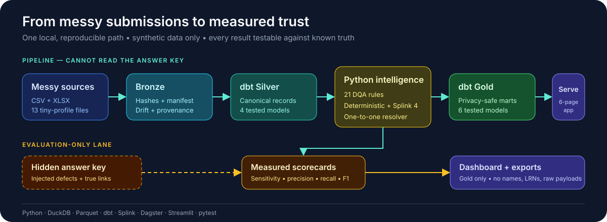
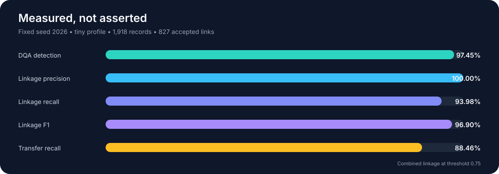

# Measured Trust: an auditable data-integration pipeline

> Connect records that were never designed to connect—and measure how much trust survives.

Operational databases rarely share one clean identity. Files drift. Dates
break. Names change spelling or order. The same person can disappear from a
join or appear twice in a dashboard. This pipeline finds those risks, repairs
what it can, and leaves evidence for every decision.

The demonstration uses a fully synthetic school-feeding case inspired by the
SBFP data shape. It contains no real person or institution records. The design
applies to customer, patient, beneficiary, workforce, survey, and education
systems with related records but incompatible identifiers.

**[View the Measured Trust showcase deck](docs/showcase_deck/measured_trust.pdf)**



## The proof is built in

Most data demos say their checks work. This one creates a hidden answer key
alongside the synthetic data. The live flow cannot read that key. Only the
evaluation step uses it to score every planted flaw and true identity link.

Here is one fixed-seed run of the small test set:

| Result | Value |
|---|---:|
| Schools / source files | 5 / 13 |
| Baseline + endline records | 1,918 |
| DQA rules executed | 21 / 21 |
| Injected defects detected | **1,433 / 1,579 (90.75%)** |
| Trained Splink accepted links | 812 |
| Linkage precision @ 0.10 | **100.0%** |
| Linkage recall @ 0.10 | **92.3%** |
| Linkage F1 @ 0.10 | **96.0%** |
| Cross-group transfer recall | **73.1%** |



The app shows what the quality layer found, missed, or flagged for review. The
linkage view reports both precision and known-truth recall, then shows how each
decision threshold changes trust and review workload.

### What Splink adds

The production resolver is one globally trained Splink model. It learns how
often each agreement pattern appears among true and false pairs, saves that
model to JSON, then loads the saved model in a fresh linker for inference.
Exact LRN, sex, and source-group agreement sit inside the same model as fuzzy
name and calendar-aware birth-date evidence. Splink is a probabilistic
entity-resolution implementation of the Fellegi–Sunter model, not a deep
neural network.

Exact rules remain in the project as a transparent benchmark. They are not
accepted first or added back into the production result. At the 0.10 operating
threshold, both methods face the same held-out truth and one-to-one policy:

The proof case reflects the source SBFP workflow: 45% of endline names change
through spelling, initials, dropped tokens, or name-order shifts; 15% of birth
dates and 8% of sexes disagree across waves; and 35% of rows carry a missing or
malformed LRN.

| Method | True links | False links | Precision | Recall | F1 | Review queue |
|---|---:|---:|---:|---:|---:|---:|
| Deterministic rules | 556 | 0 | 100.0% | 63.2% | 77.4% | 46 |
| Trained Splink resolver | **812** | **0** | **100.0%** | **92.3%** | **96.0%** | 64 |

The trained model accepts 256 more true relationships overall than exact rules,
with no false accepted links in this fixed synthetic run. The accepted sets
overlap on 547 true pairs; Splink accepts 265 pairs outside the exact benchmark,
while exact rules retain 9 pairs Splink routes elsewhere. Splink also recovers
19 of 26 known cross-group moves, compared with 7 for exact rules. Candidate
generation is global, so a change of source group is evidence—not an automatic
barrier. Duplicate exact identifiers and close competing candidates are
withheld for review rather than forced into a match.

## Try the full flow

You need Python 3.11–3.12 and [uv](https://docs.astral.sh/uv/).

```bash
uv sync --extra dev
make doctor PROFILE=tiny
make pipeline PROFILE=tiny   # generate → bronze → silver → DQA/linkage → gold → score
make dashboard               # http://localhost:8501
```

That is the whole proof. One seed makes the same files, flaws, links, and
scores on each run.

The default `demo` run has 40 schools and 12,000 children. The fixed-seed
`tiny` run has 5 schools and 1,000 children. It is also the CI smoke test. The
opt-in `large` run has 150 schools and 50,000 children.

All made files are Git-ignored. This covers source data, keys, lake files, and
exports. You can make them again at any time.

## Pick one task

```bash
make generate PROFILE=tiny   # messy CSV/XLSX + answer key
make ingest PROFILE=tiny     # idempotent hash-based bronze ingestion
make silver PROFILE=tiny     # dbt silver models and tests
make dqa PROFILE=tiny        # 21 config-backed quality rules
make linkage PROFILE=tiny    # train, persist, load, and run global Splink
make gold PROFILE=tiny       # privacy-safe marts
make score PROFILE=tiny      # measured DQA and linkage scorecards
make export PROFILE=tiny     # CSV + Parquet public products
make dagster                 # observable eight-asset graph
make test && make lint
```

With Docker, run `docker compose run --rm pipeline`. Then run
`docker compose up dashboard`.

## How trust moves through the stack

Disconnected CSV and XLSX files enter an immutable bronze layer. Standardized
dbt views form silver. Python quality checks and entity resolution challenge
the records before privacy-safe marts form gold. The app and exports read only
from gold.

The secret key stays in its own test lane. Only `sbfp_platform.evaluation` may
read it. AST tests guard imports and path text. Other tests scan dbt models.
Run-time tests block names, LRNs, and raw row data from gold and exports.

Each source row gets the same ID in both the data maker and the load step:

```text
record_id = SHA256(source_file_id|source_row_number)[:16]
```

That ID links each finding to one source row. It also makes each score easy to
make again. No test label leaks into the live checks.

## What the project proves

| Part of the data work | What the build does |
|---|---|
| Data generation | A fixed seed makes the same synthetic world. It adds known defects plus schema and date shifts. Each run can make them again. |
| Data ingestion | It finds CSV and XLSX files. A hash makes each load idempotent. It keeps all old rows. Drift and error logs show what went wrong. |
| Storage and models | Parquet and DuckDB form the lakehouse. A two-stage dbt graph runs 27 dbt tests. |
| Data quality | It runs 21 rules. Scope says which rows to test. Severity ranks each hit. A scorecard counts all known flaws found. |
| Entity resolution | It links one person across records. One global Splink model learns from all baseline/endline records, is saved, and is loaded for scoring. Exact and fuzzy fields contribute evidence inside the model; a one-to-one resolver and review queue guard ambiguous decisions. |
| Orchestration | Dagster maps eight assets. From silver, DQA and Splink run side by side. Their paths meet again before gold. The graph shows each step. |
| Serving | A six-view Streamlit app shows the results. Each public product ships in CSV and Parquet. Both are easy to share. |
| DataOps | pytest guards its score floors. Ruff checks the code. GitHub Actions, Docker, and a privacy scan keep each run fit. |

## Find your way around

```text
configs/                    frozen scale, schema, DQA, and linkage policy
src/sbfp_platform/          generator, ingestion, validation, linkage, evaluation
dbt/                        staging, silver, gold models and tests
orchestration/              Dagster definitions, jobs, schedule
dashboards/                 Streamlit command center
tests/                      unit, integration, privacy, and score regression tests
docs/                       architecture, contracts, lineage, DQA, privacy, ADRs
```

Start with the [system map](docs/architecture.md), [data rules](docs/data_contracts.md),
[data path](docs/data_lineage.md), [quality checks](docs/dqa_rules.md), and the
[five-minute tour](docs/portfolio_walkthrough.md). For an external audience,
use the [showcase deck](docs/showcase_deck/measured_trust.pdf) and its
[presenter walkthrough](docs/showcase_deck/measured_trust_walkthrough.md). The schemas in
`src/sbfp_platform/contracts.py` are the source of truth.

## What this demo does not claim

- The 0.10 threshold is tuned on a fixed synthetic stress test, not a field
  prevalence estimate. A production deployment must recalibrate and monitor it.
- The model leaves 64 known relationships unresolved and recovers 19 of 26
  cross-group moves. Review remains part of the operating design.
- This is a local demo, not a shared cloud store. A live site would still need
  safe storage, user roles, data life rules, and small-cell checks.
- The scorecards test how the data work runs. They do not state real program
  impact.

The [MIT License](LICENSE) lets you use this work. You may share it too.
