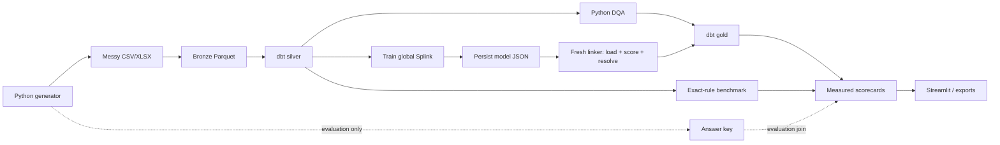

# Architecture

The platform deliberately crosses framework boundaries where each tool is strongest:
Python handles file parsing, validation, and entity resolution; dbt owns set-based
modeling; Dagster records the dependency graph; Streamlit serves only privacy-safe gold
tables.

The answer key is outside the lakehouse. Pipeline packages cannot import the evaluation
package or reference that path literally; an AST test enforces the boundary. Each raw
record is traceable by `source_file_id` and `source_row_number`. The stable `record_id`
derived from those values is the only bridge used later to measure DQA detection.

Dagster exposes eight assets: source generation, bronze, silver, issue registry,
linkage, gold, scorecards, and exports. The CLI uses the same functions, so orchestration
does not conceal a second implementation.

The deterministic path is evaluation evidence, not an upstream production pass.
Production links come only from a model trained across all source groups, written to
`trained_splink_model.json`, and loaded by a fresh linker before inference. Exact and
fuzzy comparisons are evidence inside that model; the resolver then enforces mutual-best,
one-to-one decisions and routes ambiguous pairs to review.
